# Auto sbom scanner batch file
A Windows batch script to automatically generate SBOMs and scan for vulnerabilities.

以 Windows 批次檔案 ( .bat ) 自動化匯出 SBOM 文件及弱點報表。

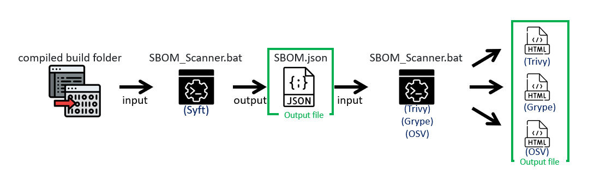

## Features
- **3-in-1 Multi-Engine Scanning**

  Combines the power of **Trivy**, **Grype**, and **OSV-Scanner** to deliver maximum vulnerability detection coverage.
  
  結合 Trivy、Grype 和 OSV-Scanner 的強大功能，提供最大化的弱點偵測覆蓋率。

- **One-Click Automation**

  Automatically generates standardized SBOM JSON files and performs vulnerability scanning in a single run.
  
  單次執行能自動產出標準的 SBOM JSON 檔案並執行弱點掃描。

- **Directory-Targeted**

  Just input your compiled build folder to analyze all software dependencies instantly.
  
  只需輸入編譯好的建置資料夾，即可立刻分析所有軟體相依性。

- **Native Windows Batch**

  Runs efficiently via a lightweight `.bat` script, requiring zero complex environment setups like Python or Node.js.
  
  透過輕量化的 `.bat` 腳本高效執行，完全不需要安裝 Python 或 Node.js 等複雜環境。

- **CI/CD Ready**

  Easy to integrate into local development workflows or Windows-based automation pipelines.
  
  非常容易整合進本地開發工作流程或 Windows 架構的 CI/CD 自動化管線中。
---
# 前置準備

### **SBOM Json 檔案匯出工具：Syft**
- Syft 工具下載網址：[https://github.com/anchore/syft/releases](https://github.com/anchore/syft/releases)
- 適合手動加入的 dll，透過二進位特徵解析檔案，若有找到軟體資訊會自動判斷為package，不同的路徑的檔案對工具來說會視為不同的項目，因此可能會有多筆重複的名稱。
- 專案中有較多自行加入參考的套件 ( .dll )，因此套件管理器 ( NuGet ) 的清單中不會有這些資料，透過 Syft 可直接掃描編譯完後的資料夾，產出的 SBOM 檔案包含套件管理器及自行加入的套件。

檔案位置：將 syft.exe 放置於 SBOM_Scanner.bat 同資料夾中 ( ./ )。

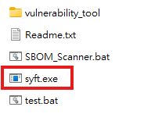

### **弱點比對工具 - 1：Trivy** 
- Trivy 工具下載網址：[https://github.com/aquasecurity/trivy/releases](https://github.com/aquasecurity/trivy/releases)
- 此工具也可掃描並產生SBOM，但主要針對套件管理器的清單為主，故只使用弱點比對功能。
- 將已有的 SBOM Json 檔案透過 Trivy 的官方資料庫比對弱點產出結果。

檔案位置：將下載的 trivy 整包工具內容放置於 vulnerability_tool 的 trivy 資料夾中 ( ./ vulnerability_tool / trivy )。

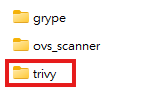

### **弱點比對工具 - 2：Grype** 
- Grype 工具下載網址：[https://github.com/anchore/grype/releases](https://github.com/anchore/grype/releases)
- 將已有的 SBOM Json 檔案透過 Grype 的官方資料庫比對弱點產出結果。

檔案位置：將下載的 Grype 整包工具內容放置於 vulnerability_tool 的 grype 資料夾中 ( ./ vulnerability_tool / grype )。

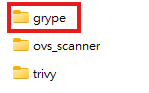

補充：欲產出 Html 結果須加入 html.tmpl 檔案。

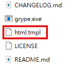

### **弱點比對工具 - 3：OSV-scanner** 
- OSV-scanner 工具下載網址：[https://github.com/google/osv-scanner/releases](https://github.com/google/osv-scanner/releases)
- 將已有的 SBOM Json 檔案透過 Google 提供的方法，主要進行分析弱點比對 OSV-scanner 的官方資料庫產出結果。

檔案位置：將下載的 osv-scanner_windows_amd64.exe 工具內容放置於 vulnerability_tool 的 osv_scanner 資料夾中 ( ./ vulnerability_tool / osv_scanner )。

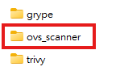

---
# 產出結果

1. SBOM Json 檔案
2. 比對弱點結果 ( Cmd 畫面顯示、Html 頁面顯示、Json 檔案... )

目前產出結果以 Html 為例。

---
# SBOM_Scanner 整體流程

### **SBOM_Scanner.bat 執行流程**

- **Step0. 編輯批次檔確認及設定可連外網的 Proxy 網址，若不需要可註解或刪除。**
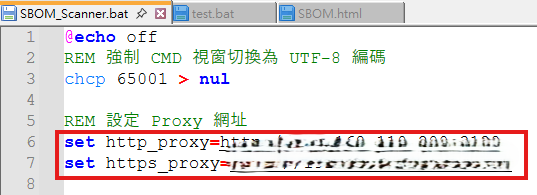
- **Step1. 兩種使用方法**
	- a. **指令執行**：系統管理員身分開啟命令提示字元，指令方式帶目標專案路徑參數執行。
	```
  SBOM_Scanner.bat [compiled build folder]
  ```
	- b. **雙擊執行**：雙擊點開輸入目標專案路徑執行。
	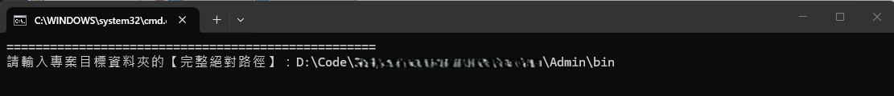
- **Step2. 自動建立 Log 資料夾或續寫 Log 資料**
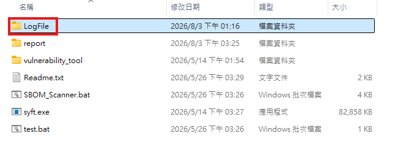
- **Step3. 自動建立 report 匯出資料夾，若已存在則會將其刪除並新建立資料夾**
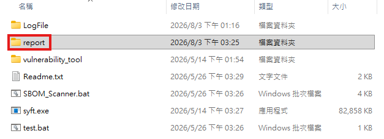
- **Step4. Syft 產出 SBOM Json 檔案資料，並存於 report 資料夾中**
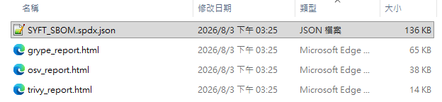
- **Step5. Trivy 比對弱點資料庫，產出 Html 報告結果，並存於 report 資料夾中**
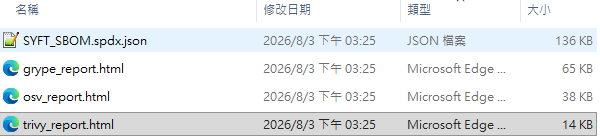
- **Step6. Grype 比對弱點資料庫，產出 Html 報告結果，並存於 report 資料夾中**
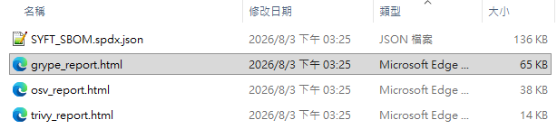
- **Step7. OSV 比對弱點資料庫，產出 Html 報告結果，並存於 report 資料夾中**
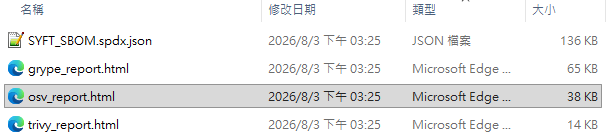

***額外測試 ErrorLevel 及 ErrorLog 儲存資訊***

- **Test.bat 測試內容**

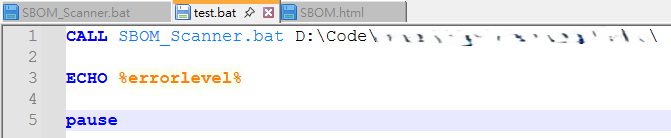
- **執行成功結果 ErrorLevel = 0**

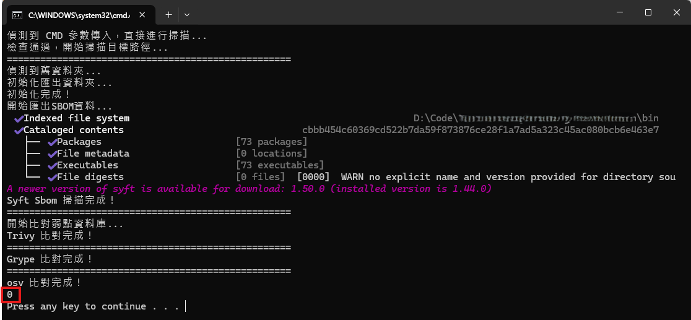
- **執行失敗結果 ErrorLevel = 1**

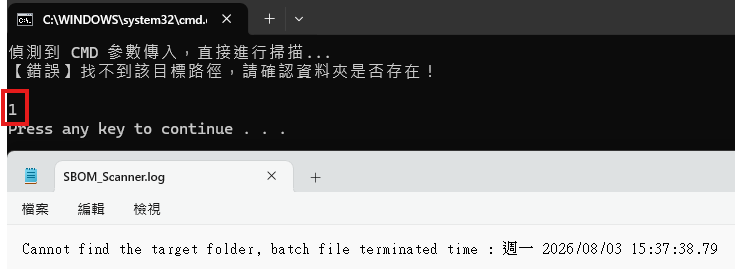
